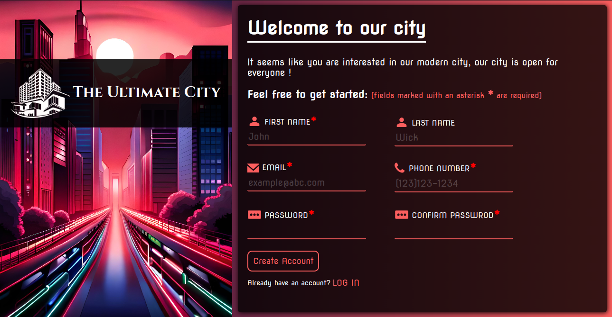

# Sign-up-Form
## Result

[LIVE DEMO](https://silva-mo.github.io/Sign-up-Form/)

## About the project
- This is my sixth TOP project, It requires a good experience in intermediate HTML, CSS, and JS.

- This time, I wanted to make it unique and different from the other sign-up forms that's why I made it:
 1. User-friendly
 2. Responsive
 3. Beautiful
 4. Easy for different users

 Alhamdulillah

## What was needed to complete it:
- intermediate HTML, and CSS skills
- Constraint Validation API JS skills
- Flexbox and styling skills 

## Challenges that I've overcome: 
- Making the design responsive for mobile devices
- Organizing the form controls in a way that looks beautiful and well structured
- Using customizable error messages by JS